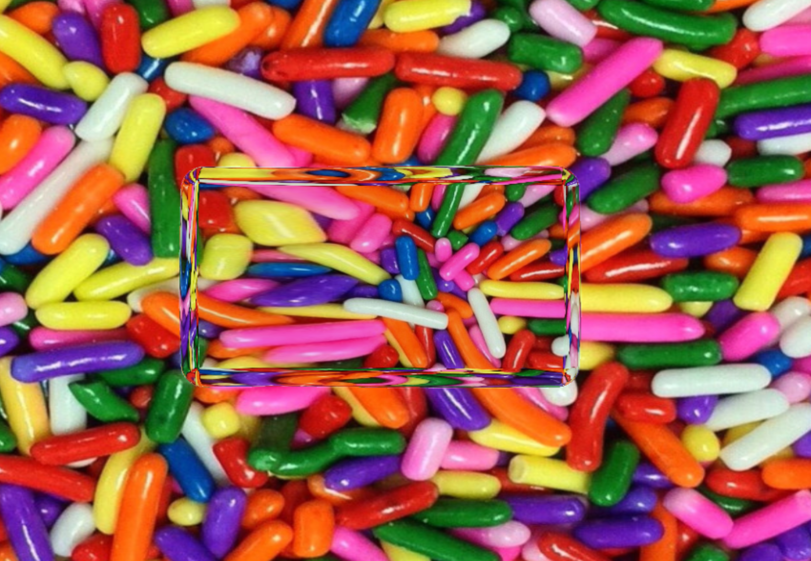

# Liquid Glass WebGL Demo

这是一个基于 WebGL 的 Liquid Glass（液态玻璃）视觉特效演示项目。它使用 SDF（有符号距离场）、Ray Marching（射线行进）、折射和背景图片渲染出类似液体玻璃的效果。

## 功能亮点

- **SDF + Ray Marching**：通过有符号距离场和射线行进算法渲染玻璃体积。
- **物理折射**：模拟玻璃内部和外部的光线折射。
- **背景图片**：支持自定义背景图片，折射效果真实。
- **响应式全屏 Canvas**：自适应窗口大小。
- **GLSL 着色器实现核心视觉效果**。

## 文件结构

- [`lg.html`](lg.html)：主页面和全部 WebGL/GLSL 代码。
- `back.jpg`：默认背景图片。
- `Screenshot.png`：项目效果截图（可选）。

## 如何运行

1. 将所有文件放在同一目录下。
2. 使用浏览器直接打开 [`lg.html`](lg.html) 文件即可看到液态玻璃特效。
3. 如需更换背景图片，将 `back.jpg` 替换为你喜欢的图片，并保持文件名不变。

## 截图

## 依赖

- 仅需现代浏览器（支持 WebGL 即可），无需其他依赖。

## 致谢

- 着色器灵感来源于 Shadertoy 社区和 WebGL 相关资料。

---

> 仅供学习和演示使用。